# **esReverse Time Travel Analysis**

 

    
# **AngryPangolin CTF**

 

---

## Welcome to the CTF

The objective of that CTF is to discover `esReverse` platform.
In particular, the time travel trace : **esReverse Time Travel Analysis** (`esReverse TTA`).    

## What is a trace ?
A trace represents the recording, over a period of time, of all the states of the CPU and the physical memory of a running machine.

An analogy could be made with a film reel:

- The frames of the filmstrip would represent the evolution of physical memory.
- The soundtrack would represent the evolution of the CPU register states.

By analyzing a recorded trace, it becomes possible to move through time (forward or backward) to study the behavior of processes.

By this definition, a trace consists of all user and kernel processes.

Of course, a raw trace is difficult to use.
To work with it, preprocessing is necessary to:

- Provide a disassembly of the executed code.
- Identify the executed processes.
- Identify the Contexts of each process to work with their own virtual memory addressing.
- Identify module symbols.
- Identify used strings.

### esReverse TTA provides

- A GUI that allows for easy and visual interaction with the trace
    - Easily navigate through time.
    - Search for information (Strings, Symbols, memory values, etc.).
    - Filter information (Processes, Strings, execution level—Ring0/3 for Intel, etc.).
    - Track values (moving forward or backward in time) in CPU registers or memory (based on the Taint principle).

- A Python API that enables automation and access to specific information not available in the GUI by default.
The esReverse Python API can be used within a Jupyter Notebook, offering great flexibility in presenting results.

**Warning:** If you are used to work with a **debugger** (live) or a **disassembler** (static), reading the disassembly of a Time Travel trace can be surprising at first.    
That is because the Time Travel analysis **only** shows the executed code during the recording.
All the basic blocks that were not executed will not be shown in the trace.

Still, you can get the non executed code as follow:
- By loading the target module in a **disassembler**, such as Binary Ninja, and synchonizing the trace with ret-sync.
- You can use the Python API to disassemble the non executed code that is present in memory even if not executed.

Moreover, the trace accurately shows the system state through time. That is, the disassembly also shows the executed code by the Kernel.

## esReverse GUI
For an overview of the Time Travel GUI, please have a look at the following chapters of the documentation :
1) **Axion Views** : `page 184`
2) **Navigating the trace in Axion** : `page 206`

## AngryPangolin CTF

For this challenge, you have access to the platform **esReverse**, particularly the Time Travel trace of a binary executed in a `Windows 10` environement.
The binary is called `angrypangolin.exe` and is compiled for `Intel 64bit`.    
`angrypangolin.exe` takes one parameter as input.
Of course, for the recording, `angrypangolin.exe` was executed with a parameter that is not the correct flag.
However, something tells me that this isn't a problem to find the real flag.

    
#### **The objective of this challenge is to find which paremeter, passed to`angrypangolin.exe`, will be considered as valid.**

# Help

There are mulitple ways to start the analysis.
Some will follow the argument from the start of main.
Others will start from the verification of the flag and go back in time.
A pre-analysis in a static analysis tool such as Binary Ninja can also help find other interesting starting points.

In any case, you will probably need to use multiple tools.
We provided you with different tools in the platform.

Thanks to our friends from **Vector35** you have access to a fully functional **Binary Ninja** license for this challenge ;)

Here are a few clews :

#### g1) Bookmarks view   
**Bookmarks** allow to anotate and/or describe anything for any transitions. It is then quite easy to move around and start from these points.

This trace contains a few bookmarks **Bookmarks**.    
They are placed right on `APIs windows` calls.    
These bookmarks document the different `APIs` used.    

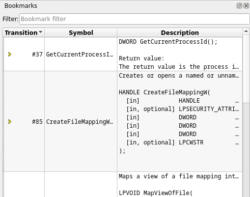

The **Bookmarks** entry are shown with a yellow star in the disassembly:    

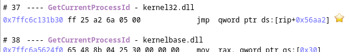

#### 2) Search view

From this view, you can search for interesting points in the trace.
For example, every transitions that belong to a certain binary. Or you can search for each time a particular function is executed.

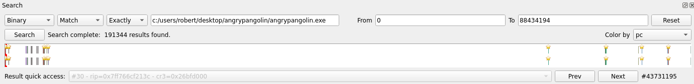

#### 3) Physical history view

This view allows you to track read/write accesses in the entire trace to a particular physical memory range.

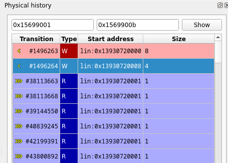

#### 4) Strings view

The Strings view allows displaying and filtering all accessed memory buffers in the trace that look like valid strings.
This is **not** the static strings from your usual favorite reverse engineering tool (strings), these are from the runtime in the trace.

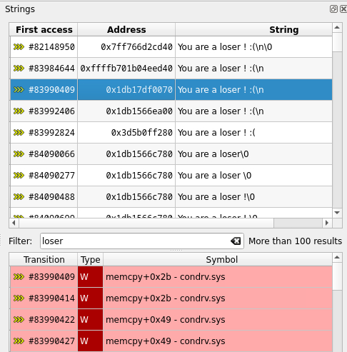

#### 5) Taint Analysis view

The taint view allows to follow the data flow in the trace, either forward or backward.    
The taint analysis automates the task of following some data from memory buffers and registers to other buffers.    
When performing a backward taint, it allows to find the origin of the tainted data.

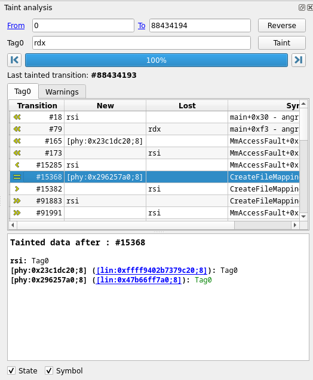

#### 6) Calltree view

The Calltree view provides a tree representation of the ancestor and sibling calls around the currently selected transition in the Trace view.     
This calltree is dependent on the stack currently in use, and as such is local to the current process and thread.

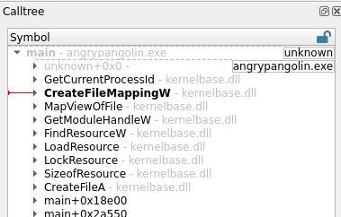

#### 7) Backtrace view

The Backtrace view provides a list of nested calls for the currently selected transaction in the Trace view, akin to what would be expected in a debugger.    
This backtrace is dependent on the stack currently in use, and as such is local to the current process and thread.

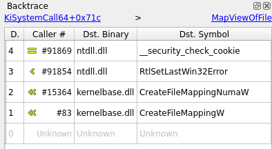

#### 8) Memory history view

The Memory History view displays the history of the accesses to the selected memory buffer.

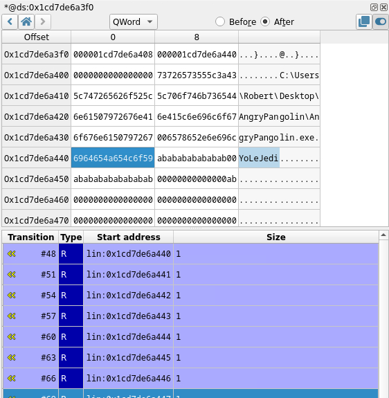

#### 9) CPU view

The CPU view displays the state of CPU registers

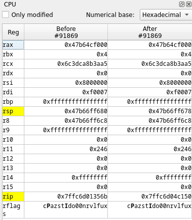

#### 10) Trace view

The Trace view represents the flow of system state transitions in the recorded scenario under analysis.

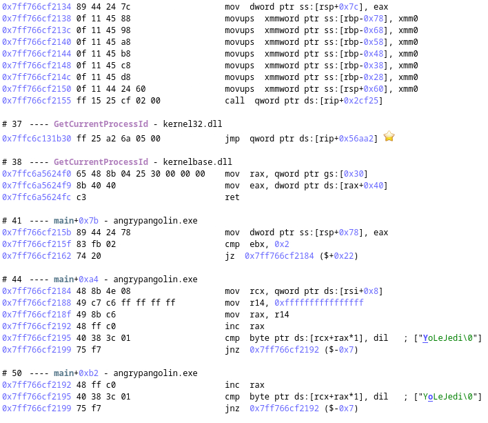
